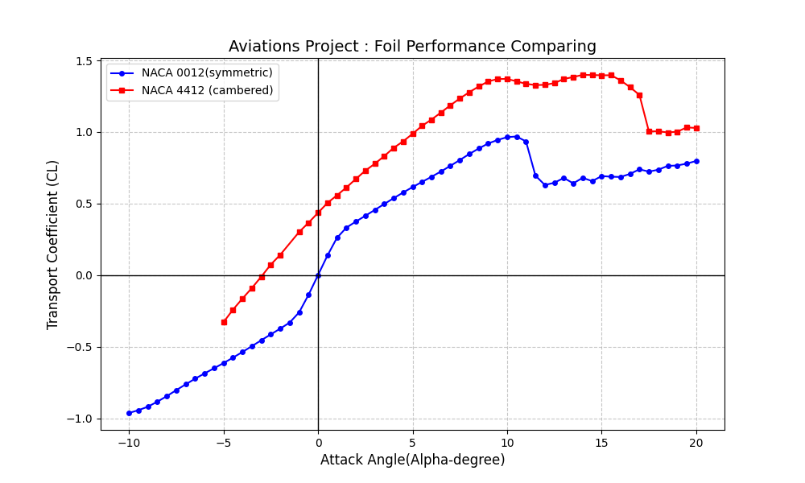

# Airfoil-Analysis-XFLR5-Python

This project is developed to process and visualize aerodynamic analysis data for airfoil performance comparison.

## Key Features
- **XFLR5 Analysis:** Comparative performance data of **NACA 0012**  and **NACA 4412**  airfoils at $Re = 100,000$.
- **Python Data Processing:** Automating the parsing of raw `.txt` polar files using the **Pandas** library.
- **Visualization:** Generating high-quality plots with **Matplotlib** to analyze Lift Coefficient ($C_L$) vs. Angle of Attack ($\alpha$).
- **Engineering Insights:** Comparison of stall angles and zero-lift drag characteristics between symmetric and cambered profiles.

## Tools & Technologies
- **XFLR5 v6.61:** For aerodynamic polar generation.
- **Python 3.x:** Core programming language.
- **Pandas:** For data manipulation and cleaning.
- **Matplotlib:** For professional-grade engineering plots.

## Analysis Result

